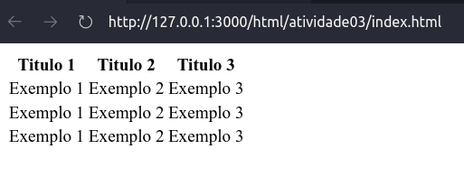
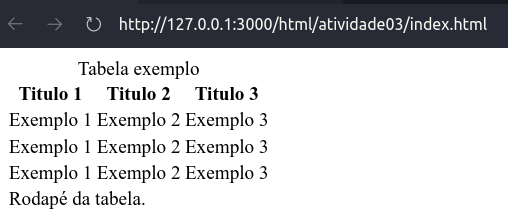
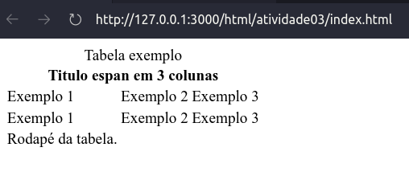
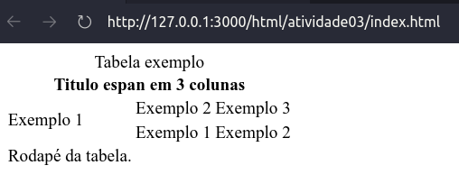

# TAGS HTML

HTML é uma linguagem de marcação de hypertexto, interpretada pelos navegadores de internet afim de criar um sistema de naveção interpretado. Abaixo você pode conferir as principais tags da linguagem em sua versão mais atual (HTML5).

## TAGS SEMANTICAS PARA FORMATAÇÃO DE TEXTO

|Tag| Descrição|
|-|-|
|&lt;br&gt;|Define uma quebra de linha|
|&lt;del&gt;|Define um texto excluido de forma taxada|
|&lt;em&gt;|Define uma enfase em italico|
|&lt;hr&gt;|Cria uma linha horizontal|
|&lt;ins&gt;|Define uma inserção sublinhada|
|&lt;p&gt;|Define um paragrafo|
|&lt;strong&gt;|Define um texto forte em negrito|
|&lt;sub&gt;|Define um texto subscrito|
|&lt;sup&gt;|Define um texto sobscrito|

## TAGS SEMANTICAS ADICIONAIS PARA FORMATAÇÃO DE TEXTO

|Tag| Descrição|
|-|-|
|&lt;abbr&gt;|Cria um pop-up de informação para o significado de siglas|
|&lt;address&gt;|Define um endereço de contato para o autor de um bloco|
|&lt;blockquote&gt;|Define um bloco de citação|
|&lt;code&gt;|Define uma fonte monoespaçada, geralmente usando para codigos|
|&lt;dfn&gt;|Define uma definição para um item.|
|&lt;mark&gt;|Marca um texto com fundo colorido|
|&lt;pre&gt;|Define uma pré-formatação, incluindo os espaços|
|&lt;q&gt;|Define uma breve citação inline|
|&lt;small&gt;|Define letras de rodapé para textos discretos|

## SIMBOLOS

|Tag seguido de ;|Simbolo|Descrição|
|-|-|-|
|&copy|&copy;|Simbolo de copyright|
|&reg|&reg;|Simbolo de marca registrada|
|&trade|&trade;|Simbolo de trademark|
|&cent|&cent;|Centavos norte-americanos|
|&euro|&euro;|Simbolo de moeda euro|
|&pound|&pound;|Simbolo de libra esterlina|
|&yen|&yen;|Simbolo de moeda Yene|
|&delta|&delta;|Simbolo de delta minusculo|
|&Delta|&Delta;|Simbolo de delta maisuculo|
|&uarr|&uarr;|Seta para cima|
|&darr|&darr;|Seta para baixo|
|&larr|&larr;|Seta para esquerda|
|&rarr|&rarr;|Seta para direita|

## EMOJI

Para adicionar emoji basta iniciar a sequencia `&#x[codigo hexadecimal]`. <p>Por exemplo o codigo a seguir: &#x1F466  gera o seguinte emoji: 👦</p>

[Clique aqui](https://emojipedia.org/) para conseguir seus emojis favoritos.

## LISTAS

Existem 3 tipos de lista em HTML

### Ordenada
```html 
    <ol>
        <li>Facebook</li>
        <li>Instagram</li>
        <li>Orkut</li>
        <li>Msn</li>
    </ol>
```
**Resultado:**
<ol>
    <li>Facebook</li>
    <li>Instagram</li>
    <li>Orkut</li>
    <li>Msn</li>
</ol>

No caso de lista ordenadas ainda é possivel escolher algumas propriedades que possibilitam um aspecto diferente de organização, como por exemplo:
  
* `type="1"` : podemos trocar o numero 1 por A, a, I ou i para substituir a organição numerecia por alfabetica ou romana. 
* `start="10"` : podemos escolher de qual posição a organização se iniciara.
* `reversed` : faz a organização na forma reversa.


### Não ordenada

```html
    <ul>
        <li>Café</li>
        <li>leite</li> 
        <li>pão</li> 
    </ul>
```
**Resultado:**
<ul>
    <li>Café</li>
    <li>leite</li> 
    <li>pão</li> 
</ul>

No caso de lista não ordenadas ainda é possivel estilizar o sinalizador atraves do CSS como por exemplo:
  
* `style="list-style: square;"` : cria um marcador quadrado.
* `style="list-style: circle;"` : cria um marcador circular vazado.
* `style="list-style: disc;"` : cria um marcador circular preenchido.
* `style="list-style: none;"` : remove o marcador.


### Descritiva

```html
<dl>
    <dt>Facebook</dt>
        <dd>Rede social criada por Mark Zuckerberg</dd>
    <dt>Instagram</dt>
        <dd>Rede social focada no compatilhamento de midias visuais</dd>
    <dt>Orkut</dt>
        <dd>O que dizer dessa rede social que mal conheço mas ja considero pakas?!</dd>
</dl>
```
**Resultado:**
<dl>
    <dt>Facebook</dt>
        <dd>Rede social criada por Mark Zuckerberg</dd>
    <dt>Instagram</dt>
        <dd>Rede social focada no compatilhamento de midias visuais</dd>
    <dt>Orkut</dt>
        <dd>O que dizer dessa rede social que mal conheço mas ja considero pakas?!</dd>
</dl>

**Misturando listas**

Vale lembrar que você pode misturar listas uma na houtra como no exemplo abaixo:
```html
    <dl>
        <dt> Top games </dt>
            <dd>
                <ol>
                    <li>Mortal kombat</li>
                    <li>Granturismo</li>
                    <li>Street fighter</li>
                </ol>
            </dd>
        <dt> Top musicas</dt>
        <dd>
            <ol>
                <li>Bom é quando faz</li>
                <li>Odiosa natureza humana</li>
                <li>Robocop </li>
            </ol>
        </dd>    
    </dl>
```
**Resultado:**

<dl>
    <dt> Top games </dt>
        <dd>
            <ol>
                <li>Mortal kombat</li>
                <li>Granturismo</li>
                <li>Street fighter</li>
            </ol>
        </dd>
    <dt> Top musicas</dt>
    <dd>
        <ol>
            <li>Bom é quando faz</li>
            <li>Odiosa natureza humana</li>
            <li>Robocop </li>
        </ol>
    </dd>    
</dl>

## Link

Insira na propriedade "href" o link local ou remoto.

```html
<a href="https://github.com/lucianolpsf">Meu github.</a>
```
**Resultado:**

<a href="https://github.com/lucianolpsf">Meu github.</a>

## IMAGEM

Insira na propriedade "src" o link local ou remoto de sua imagem. Já na propriedade "alt" insira um texto alternativo para caso a imagem não seja encontrada ou possibilitada de carregar.

```html

```
**Resultado:**


## TABELAS

Tabelas são um aspecto importante para qualquer website principalmente quando se é necessario organizar dados na tela.

No exemplo abaixo temos as seguintes tags:

- `<table>` = TABLE :indica o inicio de uma tabela
- `<tr>` = TABLE ROW : indica o inicio da linha de uma tabela 
- `<th>` = TABLE HEADER: indica o inicio do titulo de uma tabela
- `<td>` = TABLE DATA: indica o inicio de uma celula de dados de tabela

```html
<table>
    <tr>
        <th>Titulo 1</th>
        <th>Titulo 2</th>
        <th>Titulo 3</th>
    </tr>

    <tr>
        <td>Exemplo 1</td>
        <td>Exemplo 2</td>
        <td>Exemplo 3</td>
    </tr>
    <tr>
        <td>Exemplo 1</td>
        <td>Exemplo 2</td>
        <td>Exemplo 3</td>
    </tr>
    <tr>
        <td>Exemplo 1</td>
        <td>Exemplo 2</td>
        <td>Exemplo 3</td>
    </tr>
</table>
```

**Resultado:**



Trocando os titulos de lugar é possivel criar outras organizações de tabelas.

```html
<table>
    <tr>
        <th>Titulo 1</th>
        <td>Exemplo 1</td>
        <td>Exemplo 2</td>
        <td>Exemplo 3</td>
    </tr>

    <tr>
        <th>Titulo 2</th>
        <td>Exemplo 1</td>
        <td>Exemplo 2</td>
        <td>Exemplo 3</td>
    </tr>
    <tr>
        <th>Titulo 3</th>
        <td>Exemplo 1</td>
        <td>Exemplo 2</td>
        <td>Exemplo 3</td>
    </tr>
</table>
```
**Resultado:**


### Tabelas semanticas

Acrescentando as tags a seguir podemos tornar uma tabela semanticamente mais correta e organizada.

- `<caption>` Cabechalho da tabela. 
- `<thead>` Cabechalho da tabela. 
- `<tbody>` Cabechalho da tabela. 
- `<tfood>` Cabechalho da tabela. 

```html
<table>
    <caption>Tabela exemplo</caption>
    <thead>
        <tr>
            <th>Titulo 1</th>
            <th>Titulo 2</th>
            <th>Titulo 3</th>
        </tr>
    </thead>

    <tbody>
        <tr>
            <td>Exemplo 1</td>
            <td>Exemplo 2</td>
            <td>Exemplo 3</td>
        </tr>
        <tr>
            <td>Exemplo 1</td>
            <td>Exemplo 2</td>
            <td>Exemplo 3</td>
        </tr>
        <tr>
            <td>Exemplo 1</td>
            <td>Exemplo 2</td>
            <td>Exemplo 3</td>
        </tr>
    </tbody>

    <tfoot>
        <tr>
            <td>Rodapé da tabela.</td>
        </tr>
    </tfoot>
</table>
```

**Resultado:**



### Espandindo linhas e colunas

Usando a propriedade `colspan ="numero de colunas a ser espandido"`, podemos colunas que ocupam espaços diferentes na tabela. Veja o exemplo:

```html
<table>
    <caption>Tabela exemplo</caption>
    <thead>
        <tr>
            <th colspan="3">Titulo espan em 3 colunas </th>
        </tr>
    </thead>

    <tbody>
        <tr>
            <td>Exemplo 1</td>
            <td>Exemplo 2</td>
            <td>Exemplo 3</td>
        </tr>
        <tr>
            <td>Exemplo 1</td>
            <td>Exemplo 2</td>
            <td>Exemplo 3</td>
        </tr>

    </tbody>

    <tfoot>
        <tr>
            <td>Rodapé da tabela.</td>
        </tr>
    </tfoot>
</table>
```

**Resultado:**



Usando a propriedade `rowspan ="numero de linhas a ser espandido"`, podemos colunas que ocupam espaços diferentes na tabela. Veja o exemplo:

```html
<table>
    <caption>Tabela exemplo</caption>
    <thead>
        <tr>
            <th colspan="3">Titulo espan em 3 colunas </th>
        </tr>
    </thead>

    <tbody>
        <tr>
            <td rowspan="2">Exemplo 1</td>
            <td>Exemplo 2</td>
            <td>Exemplo 3</td>
        </tr>
        <tr>
            <td>Exemplo 1</td>
            <td>Exemplo 2</td>

        </tr>

    </tbody>

    <tfoot>
        <tr>
            <td>Rodapé da tabela.</td>
        </tr>
    </tfoot>
</table>
```

**Resultado:**



<div style="text-align: right">

[](../README.md)

</div>